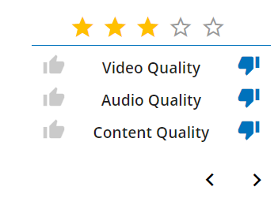

# Moodle Sidebar Plugin

Automatially gives a 3 star rating to any impartus video you watch.(You can also modify the code easily if you want to give a 5 [or 1 :) ] star rating)

This also helps you in increasing your impartus karma.

### What is karma ?

Karma points are an indicator of your activities on the Impartus platform. 
Each activity that you do on Impartus gives you some points and that is accumulated over time and the rank is calculated based on the Karma points. 

The points and rank are just an indication that how active a user is on Impartus.

### Gaining Karma

Karma is the result of a statistical model devised by Impartus to estimate the user's contribution to this platform. In plain terms, the more you contribute to the platform, and the more your contributions are voted as helpful by others, the higher is your Karma score.

Each action (e.g. sharing a note, asking a question, answering a question, watching a video) performed on the Impartus Platform awards the user some Karma. The number shown on the user's profile is the sum of all such points. The points awarded for some action types decay with time. Hence, inactivity of a longer period will gradually reduce the Karma Points of the user.

The institute leader-board is derived on the basis of aggregate Karma points. In the subsequent release of Impartus Platform, the breakup of Karma Points will be available

### Contributing

* Clone and send pull requests if you have any features to add or bugs to fix!
* Having a fork is also cool!

### Installation

1. Clone the git repo
2. Switch on 'developer mode' in Chrome Extensions
3. Load the unpacked extension

### Updating

1. Go to the location where you've cloned the repo
2. `git pull` to sync changes
3. Go to chrome and reload the extension
